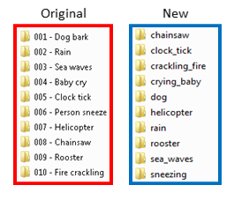

# ESC50 dataset for MCLNN

The [ESC50](https://github.com/karoldvl/ESC-10) environmental sound dataset.

| Clip Duration  | Format | Count | Categories|
|:---:|:---:|:---:|:---:|
| 5 secs | .wav (originally .ogg)  | 2000 | 50 |

Dataset Summary:
 * A 5-seconds file may contain events shorter than 5 seconds, accordingly the authors of the dataset padded all files
 to unify the 5 seconds length for all files.
 * The dataset is released into predefined 5-fold splits for cross-validation.
 
 This folder contains:
  * Scripts required to prepare the ESC50 dataset for the MCLNN processing.
  * Pretrained weights and indices for the 5-fold cross-validation in addition to the standardization parameters 
  to replicate the results in:
 
    _Fady Medhat, David Chesmore and John Robinson, "Recognition of Acoustic Events Using Masked Conditional Neural Networks," 2017 IEEE International Conference on Machine Learning and Applications (ICMLA)_
 
 ## Prepossessing
 
The following are the steps involved to prepare the ESC50 dataset:
1) Trim all files by removing the zero padding added by the authors of the dataset.
2) Clone and concatenate each sample to make its length at least equal to 5 seconds.

__Note:__ 
Some changes were applied on the dataset original repository by the authors:
 * The original files were in .ogg and now they are in .wav
 * A change was introduced to the folders naming convention and consequently the order of the files aa shown below. 
 
 

 
 The above changes will affect replicating the results reported in this experiment, if the pretrained weights and the 
  indices provded are used in combination with the new structure of the dataset. 
  Accordingly, we provided a download script in the [ESC50_download](https://github.com/fadymedhat/ESC50-for-MCLNN/tree/master/ESC50_download)
  that will pull the required files in the original order and folder naming convention before the authors modifications.
  

  
#### Preparation scripts prerequisites
                          
The [Preparation Scripts](https://github.com/fadymedhat/ESC50-for-MCLNN/tree/master/ESC50_preparation_scripts) require the following packages to be installed beforehand:
   
   * ffmpeg version N-81489-ga37e6dd
   * numpy 1.11.2+mkl
   * librosa 0.4.0
   * h5py 2.6.0
 
#### Steps

1. Download the dataset using the [ESC50_download](https://github.com/fadymedhat/ESC50-for-MCLNN/tree/master/ESC50_download) script, make sure the files of each category are in a separate folder.
If you prefer to download the dataset directly, make sure the files are ordered following the [esc50_storage_ordering](https://github.com/fadymedhat/ESC50-for-MCLNN/blob/master/esc50_storage_ordering.txt) file.
2. Position the scripts of the [Preparation Scripts](https://github.com/fadymedhat/ESC50-for-MCLNN/tree/master/ESC50_preparation_scripts) directory.
in the downloaded dataset parent directory and execute them in order following the "id_XX" index in the file name after applying any necessary configuration.
3. Configure the spectrogram transformation within the [Dataset Transformer](https://github.com/fadymedhat/MCLNN/tree/master/dataset_transformer) and generate the MCLNN-Ready hdf5 for the dataset.
4. Generate the indices for the folds using the [Index Generator](https://github.com/fadymedhat/MCLNN/tree/master/index_generator) script.
